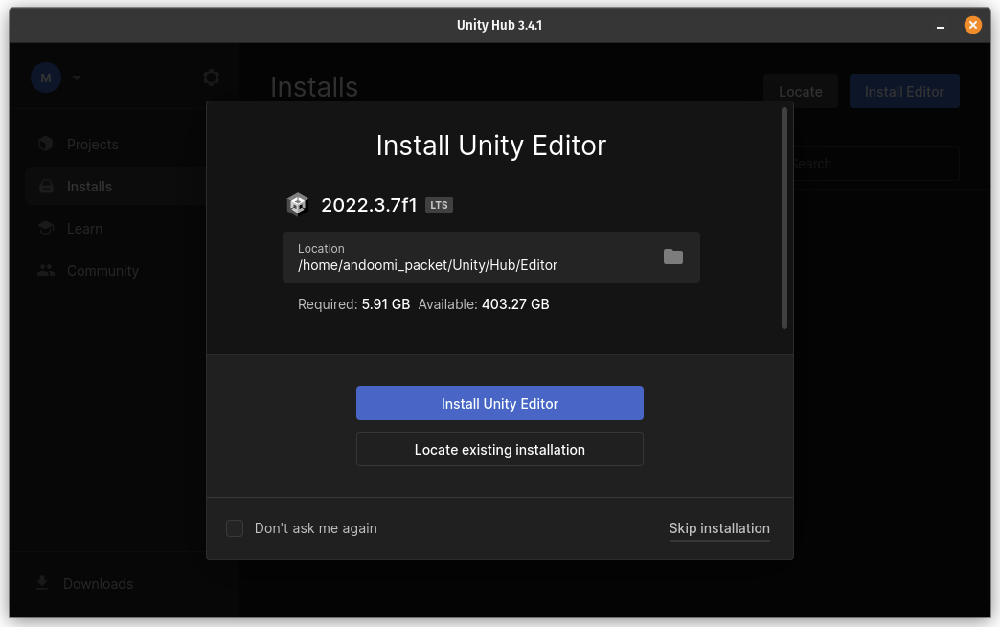
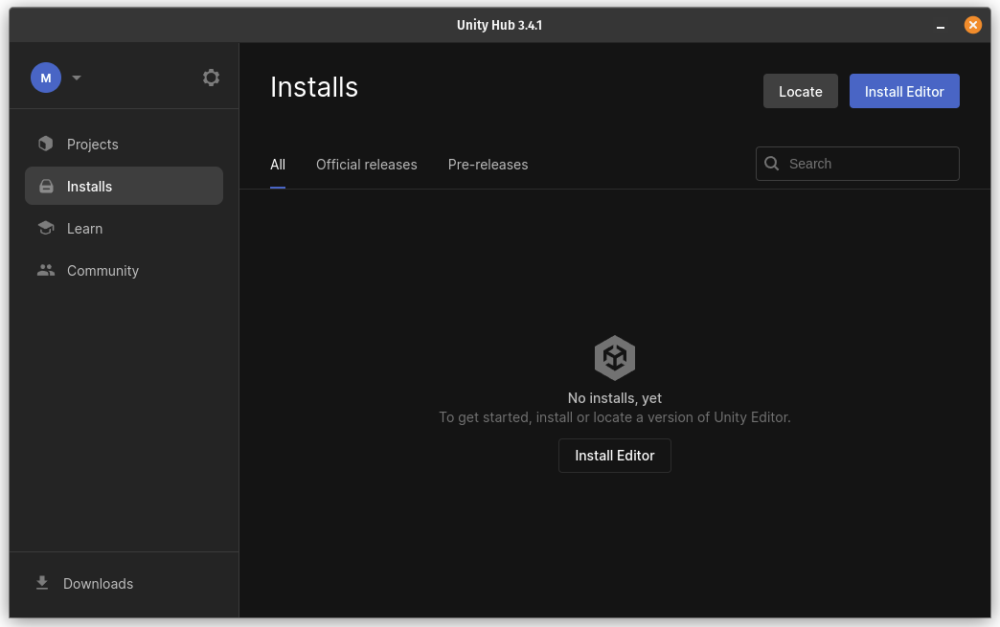
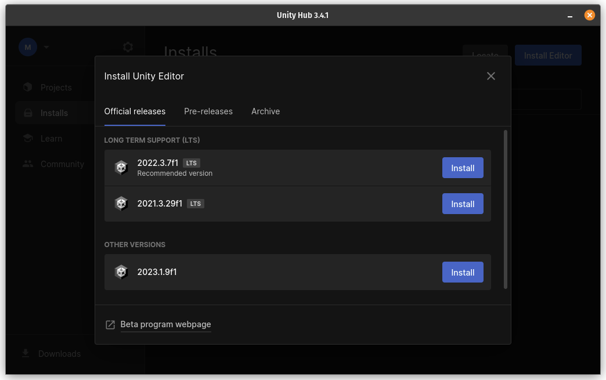
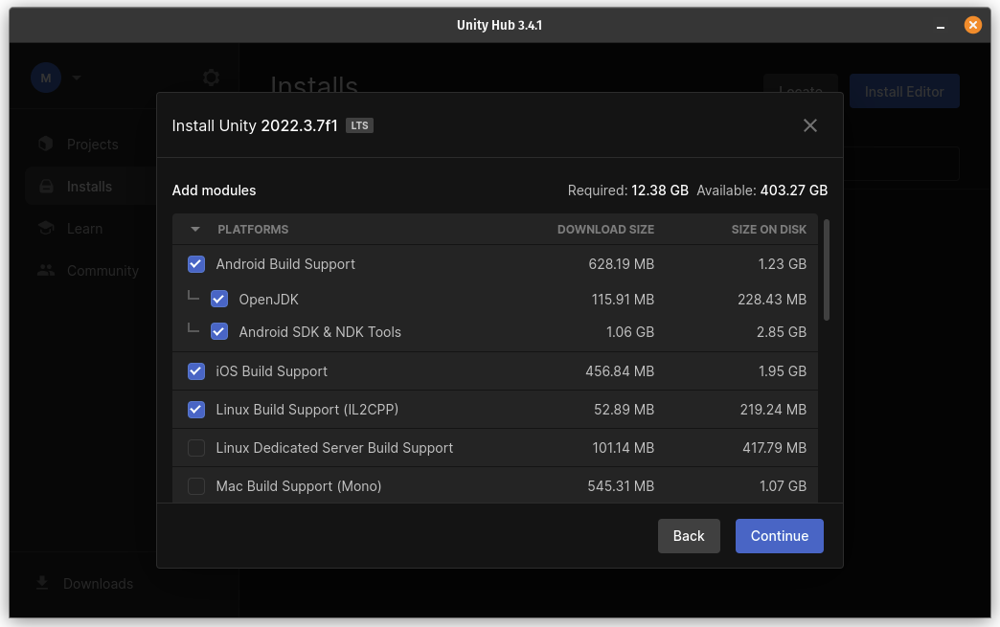
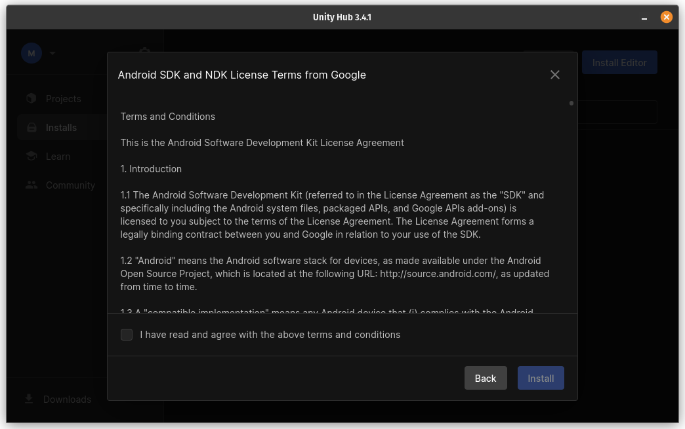

### Unity Engine - THE ENGINE WE'RE USING

For the rest of this course, we'll be using the Unity game engine to practice VideoGames Development.

#### Unity is a powerful and versatile game engine that allows developers to create interactive experiences, including both 2D and 3D games. It was first released in 2005 and has since become one of the most popular game engines in the industry. Here is a brief overview of Unity's key features and capabilities, based on the provided search results:

- **Cross-platform support**: Unity allows developers to build games for a wide range of platforms, including desktop (Windows, macOS, Linux), mobile (iOS, Android), consoles (PlayStation, Xbox, Nintendo Switch), and virtual reality (Oculus Rift, HTC Vive). This cross-platform compatibility makes it easier for developers to reach a larger audience.

- **User-friendly interface**: Unity provides a user-friendly and intuitive interface, known as the Unity Editor, which allows developers to design, build, and manage their game assets. The Editor includes a wide range of tools and features that simplify the game development process.

- Asset Store: Unity has an extensive Asset Store, where developers can find a wide variety of pre-built assets, such as 3D models, animations, sound effects, and scripts. This allows developers to save time and effort by leveraging existing assets instead of creating everything from scratch.

- **Scripting support**: Unity supports scripting in C#, which is a widely used programming language in the game development industry. Developers can write scripts to define the behavior of game objects, implement game mechanics, and handle user input. Unity also supports other scripting languages like UnityScript (deprecated) and the new Unity C# DOTS (Data-Oriented Technology Stack) for high-performance scenarios.

- **Physics and animation**: Unity includes a built-in physics engine that allows developers to simulate realistic physics interactions in their games. This engine handles collision detection, rigid body dynamics, and other physics simulations. Unity also provides a powerful animation system that simplifies character animation and allows for complex animations and interactions.

- **AI and navigation**: Unity offers tools and features for creating artificial intelligence (AI) behaviors and navigation in games. Developers can implement AI-controlled characters with pathfinding capabilities, allowing them to navigate the game world intelligently and interact with the environment and other game objects.

- **Documentation and tutorials**: Unity provides comprehensive documentation and tutorials to help developers get started with the engine and learn its features and capabilities. The documentation is regularly updated to reflect the latest Unity releases, ensuring that developers have access to accurate and up-to-date information.

***These are just some of the key features and capabilities of the Unity game engine. Unity's versatility and ease of use have made it a popular choice among game developers, from indie developers to large studios. Whether you are a beginner or an experienced developer, Unity provides the tools and resources to bring your game ideas to life.***

---

### How to get Unity

- ***Go to [Unity's Site](https://unity.com)***

- ***Click on [Download](https://unity.com/download)***

- ***Choose your operating system:***
    - [Windows](https://public-cdn.cloud.unity3d.com/hub/prod/UnityHubSetup.exe)
    - [Mac](https://public-cdn.cloud.unity3d.com/hub/prod/UnityHubSetup.dmg)
    - As for Linux then follow the instructions in the following link [Unity Hub for Linux](https://docs.unity3d.com/hub/manual/InstallHub.html#install-hub-linux)

- ***After the downloading and installationg finishes open the program***

- ***Sign-in with your Unity account, If you don't have an account then [Create One](https://www.google.com/url?sa=t&rct=j&q=&esrc=s&source=web&cd=&cad=rja&uact=8&***ved=2ahUKEwjz-prMtuSAAxUlTaQEHV5eAcMQFnoECA0QAQ&url=https%3A%2F%2Fid.unity.com%2Faccount%2Fnew&usg=AOvVaw0n64SxuFeuNAy4_Jw0ULUu&opi=89978449)

- ***Click on Skip Installation ***

- ***Click on Install Editor ***

- ***Choose the first version (Recommended Version) ***

- ***Add the necessary Modules (So you can create games on the chosen Module) ***
    - Mainly you should choose the one that fits your Operating System (i.e "Windows Build Support")
    - You can choose extra modules so you can export to those platforms, I mainly prefer to include the Android Build Support because it downloads the Android SDK and JDK automatically to enable exporting to Android Devices from the Unity Editor.

- ***Agree on any License Terms ***

- ***Now you only need to wait :D ***

  
  
