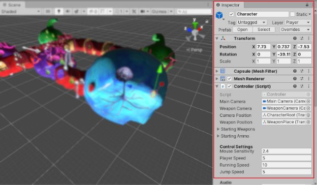
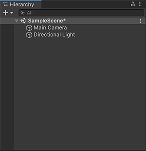
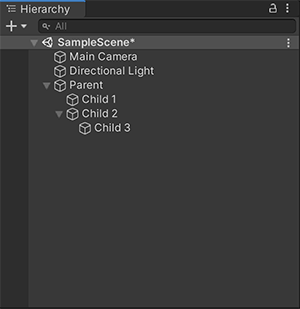
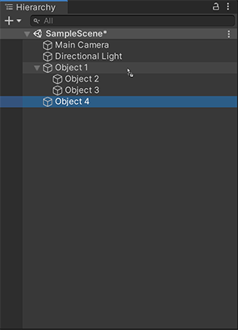

### Unity Engine - THE ENGINE WE'RE USING

For the rest of this course, we'll be using the Unity game engine to practice VideoGames Development.

#### Unity is a powerful and versatile game engine that allows developers to create interactive experiences, including both 2D and 3D games. It was first released in 2005 and has since become one of the most popular game engines in the industry. Here is a brief overview of Unity's key features and capabilities, based on the provided search results:

- **Cross-platform support**: Unity allows developers to build games for a wide range of platforms, including desktop (Windows, macOS, Linux), mobile (iOS, Android), consoles (PlayStation, Xbox, Nintendo Switch), and virtual reality (Oculus Rift, HTC Vive). This cross-platform compatibility makes it easier for developers to reach a larger audience.

- **User-friendly interface**: Unity provides a user-friendly and intuitive interface, known as the Unity Editor, which allows developers to design, build, and manage their game assets. The Editor includes a wide range of tools and features that simplify the game development process.

- Asset Store: Unity has an extensive Asset Store, where developers can find a wide variety of pre-built assets, such as 3D models, animations, sound effects, and scripts. This allows developers to save time and effort by leveraging existing assets instead of creating everything from scratch.

- **Scripting support**: Unity supports scripting in C#, which is a widely used programming language in the game development industry. Developers can write scripts to define the behavior of game objects, implement game mechanics, and handle user input. Unity also supports other scripting languages like UnityScript (deprecated) and the new Unity C# DOTS (Data-Oriented Technology Stack) for high-performance scenarios.

- **Physics and animation**: Unity includes a built-in physics engine that allows developers to simulate realistic physics interactions in their games. This engine handles collision detection, rigid body dynamics, and other physics simulations. Unity also provides a powerful animation system that simplifies character animation and allows for complex animations and interactions.

- **AI and navigation**: Unity offers tools and features for creating artificial intelligence (AI) behaviors and navigation in games. Developers can implement AI-controlled characters with pathfinding capabilities, allowing them to navigate the game world intelligently and interact with the environment and other game objects.

- **Documentation and tutorials**: Unity provides comprehensive documentation and tutorials to help developers get started with the engine and learn its features and capabilities. The documentation is regularly updated to reflect the latest Unity releases, ensuring that developers have access to accurate and up-to-date information.

***These are just some of the key features and capabilities of the Unity game engine. Unity's versatility and ease of use have made it a popular choice among game developers, from indie developers to large studios. Whether you are a beginner or an experienced developer, Unity provides the tools and resources to bring your game ideas to life.***

---

### How to get Unity

- ***Go to [Unity's Site](https://unity.com)***

- ***Click on [Download](https://unity.com/download)***

- ***Choose your operating system:***
    - [Windows](https://public-cdn.cloud.unity3d.com/hub/prod/UnityHubSetup.exe)
    - [Mac](https://public-cdn.cloud.unity3d.com/hub/prod/UnityHubSetup.dmg)
    - As for Linux then follow the instructions in the following link [Unity Hub for Linux](https://docs.unity3d.com/hub/manual/InstallHub.html#install-hub-linux)

- ***After the downloading and installationg finishes open the program***

- ***Sign-in with your Unity account, If you don't have an account then [Create One](https://www.google.com/url?sa=t&rct=j&q=&esrc=s&source=web&cd=&cad=rja&uact=8&***ved=2ahUKEwjz-prMtuSAAxUlTaQEHV5eAcMQFnoECA0QAQ&url=https%3A%2F%2Fid.unity.com%2Faccount%2Fnew&usg=AOvVaw0n64SxuFeuNAy4_Jw0ULUu&opi=89978449)

- ***Click on Skip Installation ***

- ***Click on Install Editor ***

- ***Choose the first version (Recommended Version) ***

- ***Add the necessary Modules (So you can create games on the chosen Module) ***
    - Mainly you should choose the one that fits your Operating System (i.e "Windows Build Support")
    - You can choose extra modules so you can export to those platforms, I mainly prefer to include the Android Build Support because it downloads the Android SDK and JDK automatically to enable exporting to Android Devices from the Unity Editor.

- ***Agree on any License Terms ***

- ***Now you only need to wait :D ***
---

  
  

## Unity’s interface

This section provides a detailed tour of the most common editor windows, and how to make full use of them.

***The most common windows in their default positions***

- **(A)** [The Toolbar](https://docs.unity3d.com/Manual/Toolbar.html) provides access to your Unity Account and Unity Cloud Services. It also contains controls for Play mode; Undo history; [Unity Search](https://docs.unity3d.com/Manual/search-overview.html); a layer visibility menu; and the Editor layout menu.
- **(B)** [The Hierarchy window](https://docs.unity3d.com/Manual/Hierarchy.html) is a hierarchical text representation of every **GameObject**
  in the **Scene**
  . Each item in the Scene has an entry in the hierarchy, so the two windows are inherently linked. The hierarchy reveals the structure of how GameObjects attach to each other.
- **(C)** [The Game view](https://docs.unity3d.com/Manual/GameView.html) simulates what your final rendered game will look like through your Scene **Cameras**
  . When you click the Play button, the simulation begins.
- **(D)** [The Scene view](https://docs.unity3d.com/Manual/UsingTheSceneView.html) allows you to visually navigate and edit your Scene. The **Scene view**
  can display a 3D or 2D perspective, depending on the type of Project you are working on.
- **(E)** [Overlays](https://docs.unity3d.com/Manual/overlays.html) contain the basic tools for manipulating the Scene view and the GameObjects within it. You can also add custom Overlays to improve your workflow.
- **(F)** [The Inspector window](https://docs.unity3d.com/Manual/UsingTheInspector.html) allows you to view and edit all the properties of the currently selected GameObject. Because different types of GameObjects have different sets of properties, the layout and contents of the **Inspector**
  window change each time you select a different GameObject.
- **(G)** [The Project window](https://docs.unity3d.com/Manual/ProjectView.html) displays your library of Assets that are available to use in your Project. When you import Assets into your Project, they appear here.
- **(H)** [The status bar](https://docs.unity3d.com/Manual/StatusBar.html) provides notifications about various Unity processes, and quick access to related tools and settings.

# **The Inspector Window**
Use the **Inspector** window to [view and edit properties](https://docs.unity3d.com/Manual/EditingValueProperties.html) 

and settings for almost everything in the Unity Editor, including **GameObjects**
, Unity components, Assets, Materials, and in-Editor settings and preferences.

***The Inspector window docked in the Unity Editor***

## Open an Inspector window
To open an Inspector window, do one of the following:

- From the menu, select **Windows > General > Inspector** to open a floating Inspector window.
- From any window’s More Items menu (⋮), select **Add Tab > Inspector** to open an Inspector in a new tab.

You can open as many Inspector windows as you want, and [reposition, dock, and resize](https://docs.unity3d.com/Manual/CustomizingYourWorkspace.html) them in the same way you can any other window.
## Inspect items
What you can see and edit in an Inspector window depends on what you select. This section describes what an Inspector window displays for different types of items you can select.
### Inspecting GameObjects
When you select a GameObject (for example, in the [Hierarchy](https://docs.unity3d.com/Manual/Hierarchy.html) or [Scene view](https://docs.unity3d.com/Manual/UsingTheSceneView.html)
), the Inspector displays the properties of all of its components and Materials. You can [edit the properties](https://docs.unity3d.com/Manual/EditingValueProperties.html), and [reorder the components](https://docs.unity3d.com/Manual/InspectorOptions.html#reordering-components) in the Inspector window.
### Inspect Assets
When you select an [Asset](https://docs.unity3d.com/Manual/AssetWorkflow.html) (for example, from the [Project window](https://docs.unity3d.com/Manual/ProjectView.html)), the Inspector displays settings that control how Unity imports and uses the Asset at runtime.

Each type of Asset has its own settings. Examples of Asset import settings that you edit in an Inspector window include the:

- [Model Import Settings](https://docs.unity3d.com/Manual/class-FBXImporter.html) window.
- [Audio Clip Import Settings](https://docs.unity3d.com/Manual/class-AudioClip.html) window.
- [Texture Import Settings](https://docs.unity3d.com/Manual/class-TextureImporter.html) window.
### Inspect Prefabs
When you work with Prefabs, the Inspector window displays some additional information and provides some additional options. For example:

- When you [Edit a Prefab Instance](https://docs.unity3d.com/Manual/EditingPrefabViaInstance.html), the Inspector window provides options for working with the Prefab Asset and applying overrides.
- When you apply [Instance overrides](https://docs.unity3d.com/Manual/PrefabInstanceOverrides.html), the Inspector window displays the names of properties you override in bold.

For more information about working with Prefabs in the Inspector window, see the [Prefabs](https://docs.unity3d.com/Manual/Prefabs.html)
section.

**The Hierarchy window**

The default Hierarchy window view when you open a new Unity project

The **Hierarchy** window displays every [GameObject](https://docs.unity3d.com/Manual/GameObjects.html)
in a Scene, such as models, Cameras, or [Prefabs](https://docs.unity3d.com/Manual/Prefabs.html)
. You can use the Hierarchy window to sort and group the GameObjects you use in a Scene. When you add or remove GameObjects in the Scene view, you also add or remove them from the Hierarchy window.

The Hierarchy window can also contain other Scenes, with each **Scene**
containing their own GameObjects.

## **Parenting**
Unity uses the concept of parent-child hierarchies, or parenting, to group GameObjects. An object can contain other GameObjects that inherit its properties.You can link GameObjects together to help move, scale, or transform a collection of GameObjects. When you move the top-level object, or parent GameObject, you also move all child GameObjects.

You can also create nested parent-child GameObjects. All nested objects are still descendants of the original parent GameObject, or root GameObject.

Child GameObjects inherit the movement and rotation of the parent GameObject. To learn more about this, see documentation on the [Transform component](https://docs.unity3d.com/Manual/class-Transform.html)
.

**Child 1** and **Child 2** are the child GameObjects of **Parent**. **Child 3** is a child GameObject of **Child 2**, and a descendant GameObject of **Parent**.

## Organize GameObjects

### Create new GameObjects
To create a new GameObject in the Hierarchy window:

1. Right-click on empty space in the selected Scene.
1. Select the GameObject you want to create.

You can also press **Ctrl+Shift+N** (Windows) or **Command+Shift+N** (macOS) to create a new empty GameObject.

**Note**: New GameObjects are created in “rename” mode automatically. To disable this behavior, select the More (⋮) menu in the Hierarchy window and deselect **Rename New Objects**.
### Toggle child GameObject visibility
To toggle the visibility of child GameObjects:

1. Select the drop-down arrow (►) to the left of the parent GameObject.
1. Press **Alt** while clicking the drop-down arrow (►) to toggle visibility of all descendant GameObjects of the root GameObject.
1. Select the drop-down arrow again (▼) to collapse all descendant GameObjects.
### Create child GameObjects
To create a child GameObject:

- Drag the GameObject onto the parent GameObject in the Hierarchy.

Drag **Object 4** (selected) onto the parent GameObject, **Object 1** (highlighted in a blue) to create a child GameObject.

### Create parent GameObjects
You can add a new GameObject into the Hierarchy view as the parent of existing GameObjects.

To create a parent GameObject:

1. Right-click a GameObject, or select multiple GameObjects on the same level and right-click.
1. Select **Create Empty Parent**.

You can also press **Ctrl+Shift+G** (Windows) or **Command+Shift+G** (macOS) to create a parent GameObject.

**Note**: If you have set a default parent GameObject, Create Empty Parent creates the new GameObject as a child of the default parent, not as the parent of the selected GameObjects.
### Create sibling GameObjects
A sibling GameObject is a GameObject with the same hierarchy as another child GameObject. To create a sibling GameObject:

1. Drag the GameObject above or below an existing GameObject.
1. Use the horizontal blue line to determine the order of the GameObject.

Drag **Object 4** (selected) between **Object 2** and **Object 3** (indicated by the blue horizontal line), to create a sibling GameObject under the parent GameObject **Object 1** (highlighted in a blue).
### Duplicate GameObjects
To duplicate GameObjects, right-click the target GameObject and select **Duplicate**.

You can also press **Ctrl+D** (Windows) or **Command+D** (macOS) to duplicate the selected GameObject.
### Paste GameObjects as child
You can cut or copy a selected GameObject and then paste it as a child of another GameObject. Pasted child GameObjects keep their world position.

To paste a GameObject as child:

1. Right-click the selected GameObject, and then select **Cut** or **Copy**.
1. Right-click the intended parent GameObject, and then select **Paste as Child**.

You can also press **Ctrl+Shift+V** (Windows) or **Command+Shift+V** (macOS) to paste a GameObject as a child.

[Best practice]

When you group  GameObjects  make the parent EmptyGameObject and keep the scale on (x,y,z)

Equal so you won’t end up with some wired shapes and scales in the childs GameObjects,

**ملاحظة** 
من تسوي كروب لمجموعة من الكيم اوبجكت حاول تخلي ال 
X, Y, Z 
متساوية حتى تتجنب تغير اشكال 
Game Object Childs 
و هذا مثال شلون نسويه 

**Example**: let’s create a group of 3D shapes

1. Create Empty GameObject:

2. Create 3D Object Cube, Capsule, Sphere

3. After creating the 3D shapes Objects select and drag them underneath the Empty GameObject (the one that we named it shapes)

 

---

   

# **Prefabs**

Unity’s **Prefab** system allows you to create, configure, and store a **GameObject**
complete with all its components, property values, and child GameObjects as a reusable Asset. The Prefab Asset acts as a template from which you can create new Prefab instances in the **Scene**
.

When you want to reuse a GameObject configured in a particular way – like a non-player character (NPC), prop or piece of scenery – in multiple places in your Scene, or across multiple Scenes in your Project, you should convert it to a Prefab. This is better than simply copying and pasting the GameObject, because the Prefab system allows you to automatically keep all the copies in sync.

Any edits that you make to a Prefab Asset are automatically reflected in the instances of that Prefab, allowing you to easily make broad changes across your whole Project without having to repeatedly make the same edit to every copy of the Asset.

You can [nest Prefabs](https://docs.unity3d.com/Manual/NestedPrefabs.html) inside other Prefabs to create complex hierarchies of objects that are easy to edit at multiple levels.

However, this does not mean all Prefab instances have to be identical. You can [override](https://docs.unity3d.com/Manual/PrefabInstanceOverrides.html) settings on individual prefab instances if you want some instances of a Prefab to differ from others. You can also create [variants](https://docs.unity3d.com/Manual/PrefabVariants.html) of Prefabs which allow you to group a set of overrides together into a meaningful variation of a Prefab.

You should also use Prefabs when you want to [instantiate GameObjects at runtime](https://docs.unity3d.com/Manual/InstantiatingPrefabs.html) that did not exist in your Scene at the start - for example, to make powerups, special effects, projectiles, or NPCs appear at the right moments during gameplay.

Some common examples of Prefab use include:

- Environmental Assets - for example a certain type of tree used multiple times around a level (res/Lecture-2-Basics/As seen in the screenshot above).
- Non-player characters (NPCs) - for example a certain type of robot may appear in your game multiple times, across multiple levels. They may differ (using *overrides*) in the speed they move, or the sound they make.
- Projectiles - for example a pirate’s cannon might instantiate a cannonball Prefab each time it is fired.
- The player’s main character - the player prefab might be placed at the starting point on each level (separate Scenes) of your game.

## Prefab Inspector previews
When you select a Prefab and view it in the **Inspector**
, the Asset Preview pane in the Inspector shows a preview of the Prefab. If the size of the Prefab is less than 8MB, the Asset Preview pane shows an interactive preview of the Prefab, which allows you to rotate the Prefab inside the Asset Preview pane.

If the size of the Prefab is greater than 8MB, by default the Asset Preview shows a static preview of the Prefab. To view an interactive preview of a Prefab that is greater than 8MB, click anywhere inside the Asset Preview pane.
## **Creating Prefabs**
In Unity’s **Prefab**
system, **Prefab Assets** act as templates. You create Prefab Assets in the Editor, and they are saved as an Asset in the **Project window**
. From **Prefab Assets**, you can create any number of **Prefab instances**. Prefab instances can either be created in the editor and saved as part of your **Scenes**
, or instantiated at runtime.
## Creating Prefab Assets

To create a Prefab Asset, drag a **GameObject**
from the Hierarchy window into the Project window. The GameObject, and all its components and child GameObjects, becomes a new Asset in your Project window. Prefabs Assets in the Project window are shown with a thumbnail view of the GameObject, or the blue cube Prefab icon, depending on how you have set up your Project window.

Two prefabs (“FatBlob” and “Key”) shown in the Project window in two-column view (left) and one-column view (right)

This process of creating the Prefab Asset also turns the original GameObject into a Prefab instance. It is now an instance of the newly created Prefab Asset. Prefab instances are shown in the Hierarchy in blue text, and the root GameObject of the Prefab is shown with the blue cube Prefab icon, instead of the red, green and blue GameObject icon.

A Prefab instance (Key) in the scene

### Creating Prefab instances
You can create instances of the Prefab Asset in the Editor by dragging the Prefab Asset from the Project view to the Hierarchy or **Scene view**
.

Dragging a Prefab “Key” into the Scene

You can also create instances of Prefabs at runtime using scripting. For more information, see [Instantiating Prefabs](https://docs.unity3d.com/Manual/InstantiatingPrefabs.html).

---

### Creating Material:

1. Right Click on the Project window >from the menu>Create>Material

   
1. Name the material

   
1. Change the color

   
   
1. Add it to the object simply by drag it and drop it on the object

   

  