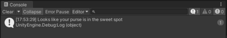

# Essentials 1

## C# Variables

Variables are containers for storing data values.

In C#, there are different **types** of variables (defined with different keywords), for example:

- int - stores integers (whole numbers), without decimals, such as 123 or -123
- double - stores floating point numbers, with decimals, such as 19.99 or -19.99
- char - stores single characters, such as 'a' or 'B'. Char values are surrounded by single quotes
- string - stores text, such as "Hello World". String values are surrounded by double quotes
- bool - stores values with two states: true or false

---

Declaring (Creating) Variables

To create a variable, you must specify the type and assign it a value:

### **Syntax**

_type variableName = value;_

Where *type* is a C# type (such as int or string), and *variableName* is the name of the variable (such as **x** or **name**). The **equal sign** is used to assign values to the variable.

### To create a variable that should store text, look at the following example:

**_Example_**

Create a variable called **name** of type string and assign it the value
"**John**":

```cs
string name = "John";

void start(){

print(name);

}
```

<br>

### To create a variable that should store a number, look at the following example

**_Example_**

Create a variable called **myNum** of type int and assign it the value **15**:

```cs
int health = 100;

void start(){

print(health);

}
```

<br>

### You can also declare a variable without assigning the value, and assign the value later:

**_Example_**

```cs
int myNum;

myNum = 15;

void start(){

print(myNum);

}
```

#### Note that if you assign a new value to an existing variable, it will overwrite the previous value:

**_Example_**
Change the value of myNum to 20:

```cs
int myNum = 15;

void start(){

myNum = 20; // myNum is now 20

print(myNum);

}
```

---

## Other Types

A demonstration of how to declare variables of other types:

**_Example_**

```cs
int myNum = 5;

double speed = 5.99;

char key = 'D';

bool isAlive = true;

string name = "Ali";
```

---

## Methods

A **method** is a block of code which only runs when it is called.
You can pass data, known as parameters, into a method.
Methods are used to perform certain actions, and they are also known as **functions**.
Why use methods? To reuse code: define the code once, and use it many times.

**There are two types**

- Procedure: doesn’t return a value
- Function: must return a value

---

### Create a Method

A method is defined with the name of the method, followed by parentheses **()**. Unity provides some pre-defined methods, which you already are familiar with, such as Start(), but you can also create your own methods to perform certain actions:

Example of creating Procedure

```cs
    void MyMethod()
    {

        // code to be executed

    }
```

**Example Explained**

- **MyMethod()** is the name of the method
- **void** means that this method does not have a return value. You will learn more about return values later in this chapter

**_Note:_** In C#, it is good practice to start with an uppercase letter when naming methods, as it makes the code easier to read.

---

### Call a Method

To call (execute) a method, write the method's name followed by two parentheses **()** and a semicolon **_;_**

#### In the following example, MyMethod() is used to print a text (the action), when it is called:

**_Example_**

Inside Start(), call the myMethod() method:

```cs
    void MyMethod()
    {
        print("I just got executed!");
    }

    void Start()
    {
        MyMethod();
    }

// Outputs "I just got executed!"
```

## Defining a function in C#

When you define a function, you basically declare the elements of its structure. The syntax for defining a method in C# is as follows −

```cs
    <Return Type> <Method Name>(Parameter List) {
        Function  Body
    }
```

Following are the various elements of a function −

- **Access Specifier** − This determines the visibility of a variable or a method from another class.
- **Return type** − A method may return a value. The return type is the data type of the value the method returns. If the method is not returning any values, then the return type is **void**.
- **Method name** − Method name is a unique identifier and it is case sensitive. It cannot be same as any other identifier declared in the class.
- **Parameter list** − Enclosed between parentheses, the parameters are used to pass and receive data from a method. The parameter list refers to the type, order, and number of the parameters of a method. Parameters are optional; that is, a method may contain no parameters.
- **Method body** − This contains the set of instructions needed to complete the required activity.

## Example

Following code snippet shows a function *FindMax* that takes two integer values and returns the larger of the two. It has public access specifier, so it can be accessed from outside the class using an instance of the class.

```cs
    int FindMax(int num1, int num2) {
        int result;

        if (num1 > num2)
        {
            result = num1;
        }else
        {
            result = num2;
        }

        return result;
    }
```

---
## If-else statements
If-else statements are the most common way of making decisions in code. When stripped all of its syntax, the basic idea is if my condition is met, execute this block of code; if it’s not, execute this other block of code. Think of these statements as gates, or doors, with the conditions as their keys. To pass through, the key needs to be valid. Otherwise, entry will be denied and the code will be sent to the next possible game.
### Basics syntax
A valid if-else statement must have the following syntax:
- The “if” keyword at the beginning of the line
- A pair of parentheses to hold the condition
- A statement body
  ```cs
    if (condition is true){
        Execute multiple lines of code
    }
    ```
Optionally, an else statement can be added to store the action you want to take when the if statement condition fails. The same rules apply to the else statement.
```cs
else
{
    Execute multiple lines of code
}
```
In blueprint form, the syntax almost reads like a sentence.
```cs
if (condition is true)
{
    Execute multiple lines of code
}
else
{
    Execute multiple lines of code
}
```
Since these are great introductions to logical thinking, at least in programming, we will break down the three different if-else variations in more detail:
1. A single if statement can exist by itself in cases where you don’t care about what happens if the condition isn’t met. In the following example, if hasDungeonKey is set to true, then a Debug.Log will print out; if it set to false, no code will execute.
```cs

public class LearningCurve: MonoBehaviour
{
    public bool has Dungeonkey = true;
    
    void Start()
    {
        if (hasDungeonkey)
        {
            Debug.Log("You possess the sacred key enter");
        }
    }
}

```
2. Add an else statement in cases where action needs to be taken whether the condition is true or false. If hasDungeonKey were false, the if statement would fail and the code execution would jump to the else statement.
```cs
public class LearningCurve : MonoBehaviour
    {
        public bool has DungeonKey = true;

        void Start()
        {
            if (hasDungeonkey)
            {
                else
                {
                    Debug.Log("You possess the sacred key enter");
                    
                    Debug.Log("You have not proved yourself worthy, warrior");
                }
            }
        }
    }
```
3. For cases where you need to have more than two possible outcomes, add an else-if statement with its parentheses, conditions, and curly brackets.
### Thieving prospects — Example:
Let’s write an if-else statement that checks the amount of money in a character’s pocket, returning different debug logs for three different cases: greater than 50, less than 15, and anything else.
1. Open up the script and add a new int variable, named currentMoney. Set its value to between 1 and 100
2. Declare an if statement to check whether currentMoney is greater than 50, and print a message to the console if this is true.
3. Add an else-if statement to check whether currentMoney is less than 15 with a different Debug.Log.
4. Add an else statement with no condition and a final default lof.
5. Save the file and click on Play.
```cs
public class LearningCurve: MonoBehaviour
public int currentMoney = 45;

void Start()
{
    if (currentMoney > 50)
    {
        Debug.Log("You're rolling in it beware of pickpockets");
        else if (currentMoney < 15)
        {
            else
            {

                Debug.Log("Not much there to steal");
                Debug.Log("Looks like your purse is in the sweet spot");
            }
        }
    }
}
```
With currentMoney set to 45 in the above example, we can break down the code sequence as follows:
1. The if statement and debug are skipped because currentMoney is not greater than 50.
2. The else-if statement and debug log are also skipped because currentMoney is not less than 15.
3. Since neither of the previous conditions was met, the else statement executes and the third debug log is displayed

---
## Loops
Loops can execute a block of code as long as a specified condition is reached.
<br>
Loops are handy because they save time, reduce errors, and they make code more readable.
---
## While Loop
The while loop loops through a block of code as long as a specified condition is True:
### Syntax
```cs
while (condition) {
  // code block to be executed
}
```
In the example below, the code in the loop will run, over and over again, as long as a variable (i) is less than 5:
### Example
```cs
bool isAlive = true;
while(isAlive)
{
    Debug.Log("I'm alive!");
}
```
## C# For Loop
When you know exactly how many times you want to loop through a block of code, use the for loop instead of a while loop:
### Syntax
```cs
for (statement 1; statement 2; statement 3) {
  // code block to be executed
}
```
Statement 1 is executed (one time) before the execution of the code block.
<br>
Statement 2 defines the condition for executing the code block.
<br>
Statement 3 is executed (every time) after the code block has been executed.
<br>
The example below will print the numbers 0 to 4:
### Example
```cs
for (int i = 0; i < 5; i++) {
  Debug.Log(i);
}
```
### Example explained
- Statement 1 sets a variable before the loop starts (int i = 0).
- Statement 2 defines the condition for the loop to run (i must be less than 5). If the condition is true, the loop will start over again, if it is false, the loop will end.
- Statement 3 increases a value (i++) each time the code block in the loop has been executed.
### Another Example
This example will only print even values between 0 and 10:
```cs
for (int i = 0; i <= 10; i = i + 2) {
  Debug.Log(i);
}
```